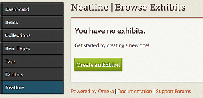
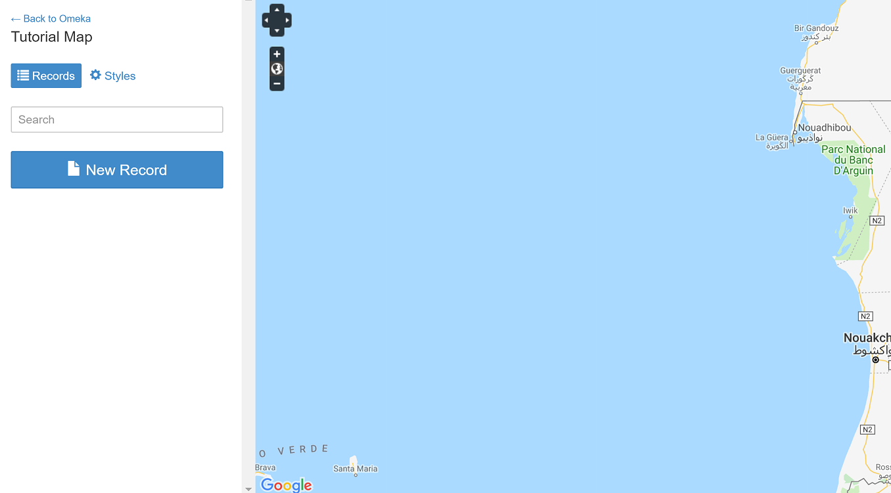
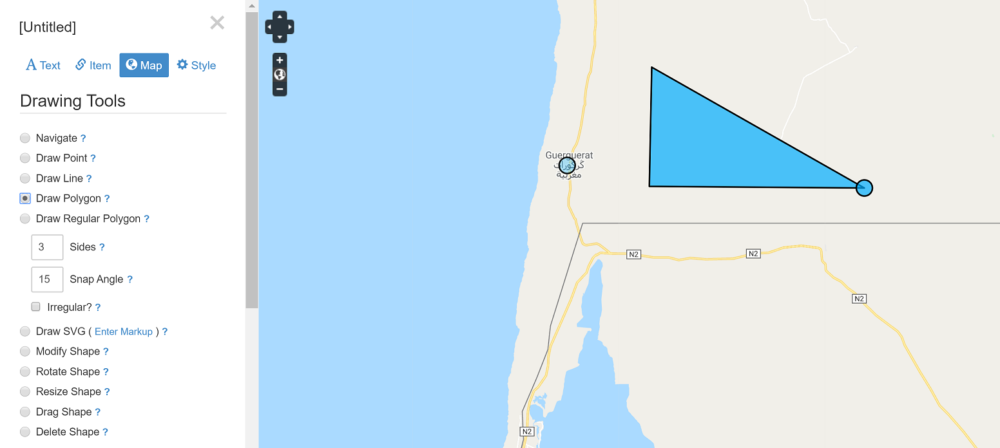

## About
Last Updated 30 July 2018  
Created by Wendy Jordan | Updated by Chelsea Smith-Antonides

## Table of Contents
* [What is Neatline?](#what-is-neatline?)
* [Starting a Neatline Map](#starting-a-neatline-map)
* [Building a Neatline Map](#building-a-neatline-map)

### What is Neatline?
Neatline is an Omeka Plugin that allows you to create a navigable map with data points and/or outlined regions. You can learn more about the plugin at [http://neatline.org/](http://neatline.org/).

[Return to Top](#about)

## Starting a Neatline Map
* Download the Neatline Plugin from **[Omeka](https://omeka.org/classic/plugins/Neatline/)** and install it to your site as outlined in the **[OU Create & Omeka](https://oudsl.github.io/OUCreate_and_Omeka/)** guide.
* Under the **Neatline** tab in your admin dashboard, select **Create Exhibit**.

* Create a title for your map. A "URL slug" will automatically generate itself below, but you can change this. This is what the map's URL will look like so make sure it's relevant to the specific project. 
* You can also create a **Narrative** for your map where you can summarize your work, but you can create or edit this later.
* Scroll down to **Default Spacial Layer** to select the type of base map (or background map) that appears in your Neatline: Street Map, Terrain Map, Satellite Map, etc. 
* Check the box to make your Neatline **Public** and save the changes to the page.

[Return to Top](#about)

## Building a Neatline Map
* You will be redirected back to the admin page.
* Select the Neatline tab on the left side of the page, and then select the map you created under **Exhibits**.
* Now this is where you get creative in constructing your map! 
* Each time you want to create a new data point, line, or polygon-enclosed region, select **New Record**.

* For each record you create, you will create a URL slug, a Title for the record, and a description of the record.
* To include photographs or links within the title or body text of your record, select **Edit HTML** to gain access to these editing options.
* The *Item* tab for your record allows you to link your record directly to an item from your Omeka site, like a picture or a text document. Doing this will allow the Neatline map to access the item's information for viewers to see.
* The *Map* tab is where you create your points/lines/shapes. Remember to save all geometry changes before navigating away from the map tab. Try out the different shapes and lines to figure out which style you like best. You can always edit them, or delete them, with the options at the bottom.

* The *Style* tab is where you can alter the appearance of your points/lines/shapes: changing the color, the thickness, the opacity, etc. 
* **Help Note** If you need additional help/explanation of a specific feature of Neatline, select the **?** button next to the aspect you have a question about for further instruction. 

[Return to Top](#about)
